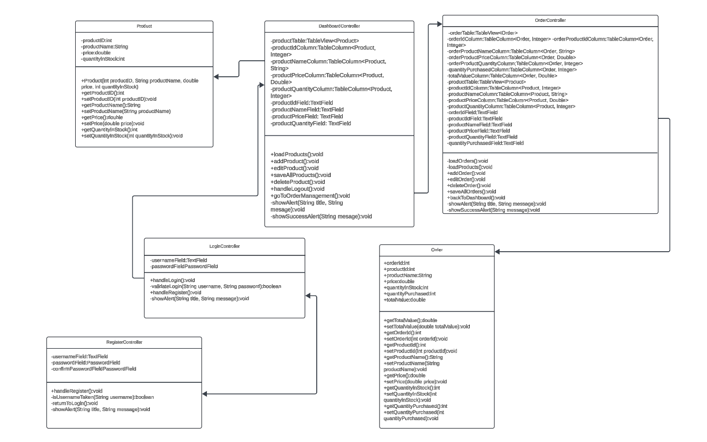
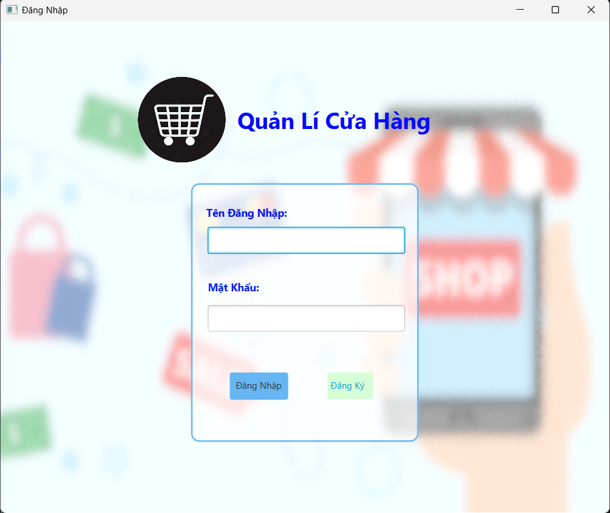
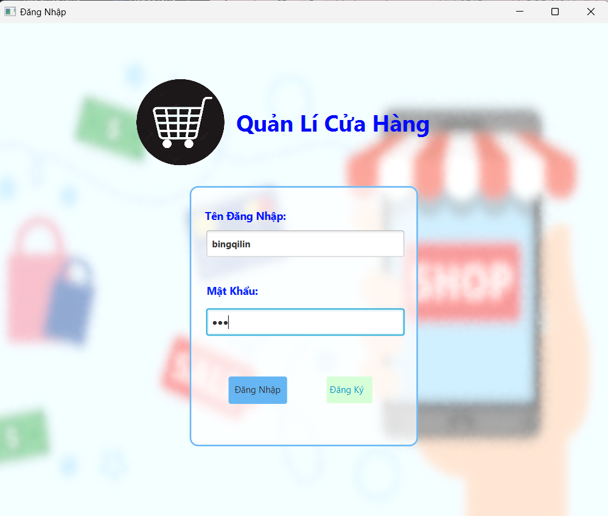
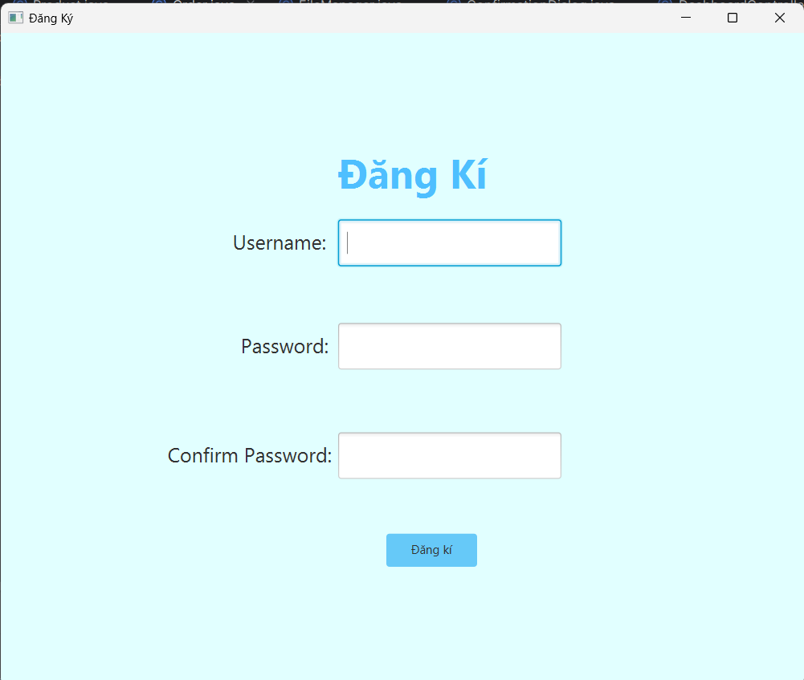
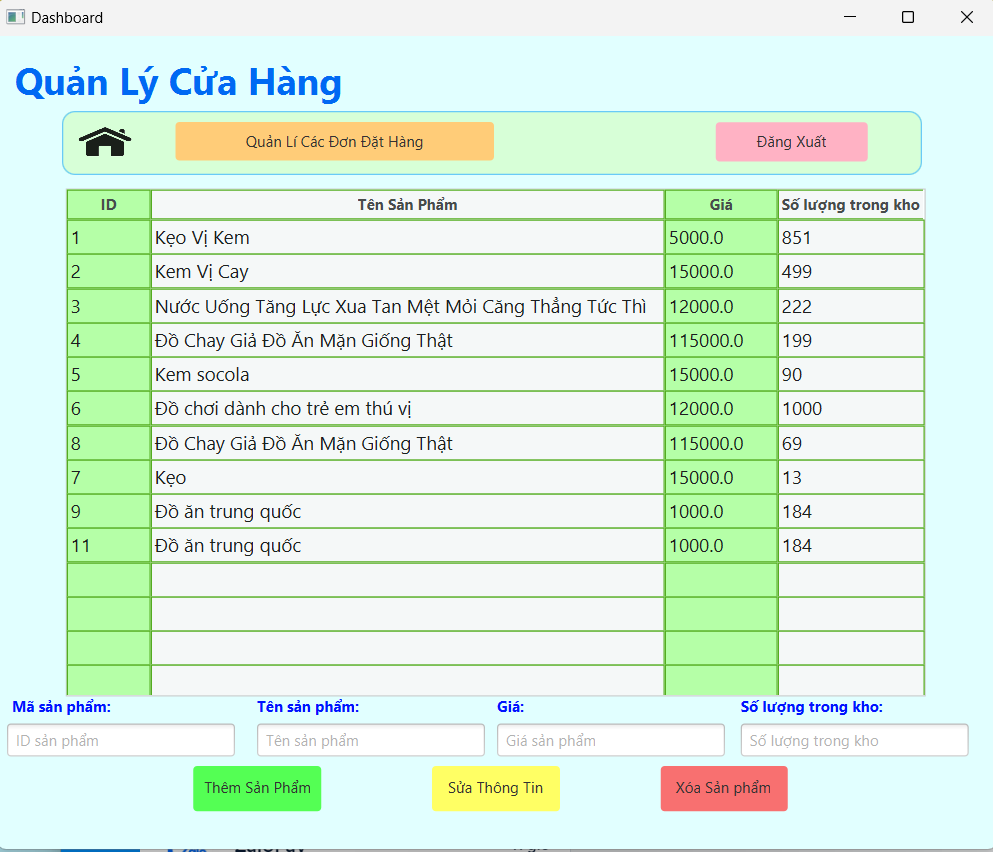

GROUP_14-OOP-N01
# Ứng Dụng Quản Lí Cửa Hàng

## Giới Thiệu Dự Án
Dự án lá một hệ thống quản lí cửa hàng, giúp dễ dàng kiểm soát các sản phẩm trong cửa hàng và có thể quản lí các đơn đặt hàng.

## Thành Viên Nhóm:
- **Nguyễn Văn Binh**: Phát triển phần mềm.
- **Nguyễn Thị Lan Anh**:Phát triển phần mềm.

## Chức Năng Chính:
-Thêm, sửa, xóa sản phẩm trong cửa hàng
-Thêm, sửa, xóa các đơn hàng
-Các sản phẩm và đơn hàng được ghi vào các file để quản lí.


## UML Dự Án

## 1.1 UML Component Diagram



## Giao diện đầu tiên


## Đăng nhập


## Đăng Kí


## Trang chính


## GitHub Pages Dự Án
[Truy cập tại đây "StoreManagementApp](https://github.com/nguyenvanbinh05/Group-14-OOP_N01/tree/finalProject)

## DEMO Sản Phẩm
[Demo video on YouTube]()


# Cách Cài Đặt
1. Clone repository từ GitHub:
   ```bash
   git clone -b finalProject https://github.com/nguyenvanbinh05/Group-14-OOP_N01.git
   


